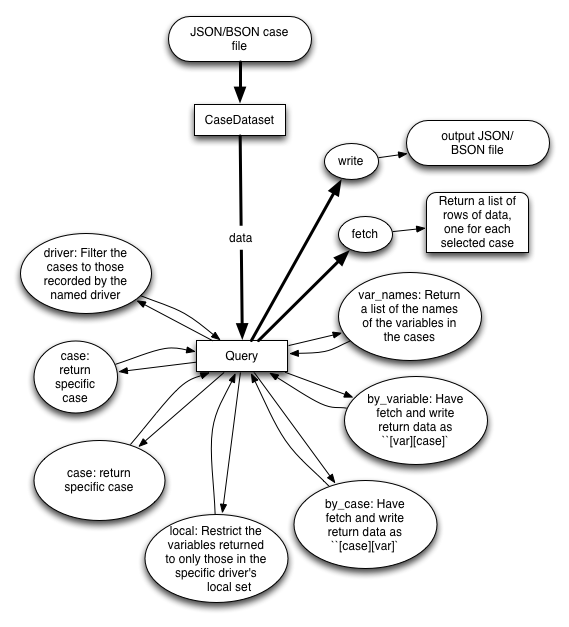

Case Recording Structure
-------------------------

Overall Concepts
++++++++++++++++

The case recording system in OpenMDAO is designed such that by default everything is recorded. Users can then use the query system to post process the data and get at the data they really need. OpenMDAO records all inputs and outputs of the model at all levels of the iteration hierarchy.  In addition it also records the metadata about the model, constants, inputs, and outputs.

The primary file formats for case recording in OpenMDAO are `JSON <http://en.wikipedia.org/wiki/JSON/>`_ and `BSON <http://en.wikipedia.org/wiki/BSON/>`_ JSON, and its binary version, BSON, were chosen because of the following benefits:

* interoperability
* openness
* simplicity
* maps directly onto the data structures used in modern programming languages
* JSON is easy to read

If users need to have the case records in another format, OpenMDAO provides post processors that convert the JSON and BSON case record files to those formats. The formats currently supported are CSV, sqlite, and a simple text-based data dump format.

Case recorders are assigned to the top level Assembly only.

Case Recording and Querying Classes
+++++++++++++++++++++++++++++++++++

Recording Classes
=================

The case recording system's three key classes are:

``_BaseRecorder`` - Base class for JSONRecorder and BSONRecorder. The key methods for this class are:

* ``get_case_info`` - get data for a particular case
* ``get_driver_info`` - get information about a given driver
* ``get_simulation_info`` - get about the overall simulation or model
* ``register`` - register a recorder

``JSONRecorder`` - Dumps a run in JSON format to any object that looks like a file
``BSONRecorder`` - Dumps a run in BSON format to any object that looks like a file

The key method is:

* ``record`` - Dump the given run data

Query Classes
=================

The case query system's two key classes are:

``CaseDataset`` - Reads case data from a file like object. The user can access the data using the Query object via the ``data`` property

``Query`` - Retains query information for a class ``CaseDataset``. All methods other than ``fetch`` and ``write`` return ``self``, so operations are easily chained. If the same method is called more than once, only the last call has an effect.

This diagram shows the relationship of these two classes and their main methods.

.. _`relationship of CaseDataset and Query Objects and Methods`:

   Relationship of CaseDataset and Query Objects and Methods

How and Where Recording takes Place
+++++++++++++++++++++++++++++++++++

This section discusses the key methods involved in recording and when they take place in the flow of running a model.

- Item 2.

  Paragraph 2 of item 2.

  * Nested bullet list.
  * Nested item 2.

    - Third level.
    - Item 2.

  * Nested item 3.

- Component.run
  * Nested bullet list.
  * Nested item 2.

    - Third level.
    - Item 2.

  * Nested item 3.

* Component.run
  + Assembly._pre_execute
    - Assembly.configure_recording
      * Driver.configure_recording
        + Workflow.configure_recording

test_jsonrecorder.py,  line 139, in test_nested
  asm1.run()
component.py,  line 512, in run
  self._pre_execute()
assembly.py,  line 203, in _pre_execute
  self.configure_reco`rding(self.recording_options)
assembly.py,  line 781, in configure_recording
  inps, consts = obj.configure_recording(recording_options)
driver.py,  line 437, in configure_recording
  return self.workflow.configure_recording(recording_options)
workflow.py,  line 506, in configure_recording
  if recording_options:

In Workflow:
   def configure_recording(self, recording_options=None):
        """Called at start of top-level run to configure case recording.

        If recording required, register names in recorders
  
      def _record_case(self, case_uuid, err):
        """ Record case in all recorders. """

Assembly:

    def configure_recording(self, recording_options=None):
        """Called at start of top-level run to configure case recording.

        Start up recorders

        Loop through containers that are either Assemblies or Drivers

        For drivers, just call configure_recording on the workflow. Which returns 
        	Determine (changing) inputs and outputs to record

        For assemblies, recursively call Assembly.configure_recording. 

        So this just goes down the iteration hierarching and set what gets recorded and return inputs and constants

Parameters
Objectives
Responses
Constraints - both eq and ineq

        for comp in driver.workflow: 
            successors = driver._reduced_graph.successors(comp.name)
            for output_name, aliases in successors:

        # also need get any outputs of comps that are not connected vars 
		#   and therefore not in the graph

        for comp in driver.workflow: 
            for output_name in scope._depgraph.list_outputs(comp.name):

        name = '%s.workflow.itername' % driver.name

In Workflow.run, 

    def _record_case(self, case_uuid, err):
        """ Record case in all recorders. """

        Parameters -> inputs
        Objectives, Responses, Constraints, other outputs -> outputs list

        Each of the recorders has its record method called

Use test_nested as an example

inputs

0 = "comp1.y"
1 = "asm2.comp1.y"
2 = "asm2.asm3.comp1.y"

constants

asm2.driver.gradient_options.fd_step_type = "absolute"
asm2.recording_options.save_problem_formulation = True
driver.gradient_options.fd_blocks = <traits.trait_handlers.list 0x10a8d6310; len=1>
recording_options.save_problem_formulation = True
asm2.asm3.force_fd = False
asm2.driver.accuracy = 1e-06
asm2.driver.gradient_options.derivative_direction = "auto"
asm2.asm3.comp1.directory = ""
driver.gradient_options.fd_step_type = "absolute"
asm2.missing_deriv_policy = "assume_zero"
driver.gradient_options.fd_step = 1e-06
comp1.force_fd = False
driver.gradient_options.fd_form = "forward"
asm2.asm3.driver.output_filename = "slsqp.out"
asm2.driver.gradient_options.fd_form = "forward"
asm2.asm3.driver.gradient_options.maxiter = 100
asm2.asm3.driver.force_fd = False
driver.iprint = 0
asm2.driver.gradient_options.directional_fd = False
asm2.asm3.driver.gradient_options.derivative_direction = "auto"
driver.gradient_options.directional_fd = False
comp1.x = 0.0
asm2.driver.gradient_options.maxiter = 100
driver.gradient_options.lin_solver = "scipy_gmres"
asm2.driver.gradient_options.fd_blocks = <traits.trait_handlers.list 0x10a8d6050; len=1>
asm2.asm3.recording_options.excludes = <traits.trait_handlers.list 0x10a8696d8; len=1>
asm2.driver.gradient_options.force_fd = False
driver.gradient_options.derivative_direction = "auto"
asm2.asm3.driver.gradient_options.directional_fd = False
comp1.missing_deriv_policy = "error"
driver.directory = ""
asm2.recording_options.excludes = <traits.trait_handlers.list 0x10a8b7d08; len=1>
asm2.comp1.force_fd = False
asm2.driver.directory = ""
comp1.directory = ""
asm2.asm3.driver.gradient_options.force_fd = False
driver.gradient_options.maxiter = 100
driver.force_fd = False
recording_options.excludes = <traits.trait_handlers.list 0x10a8d60a8; len=1>
asm2.asm3.missing_deriv_policy = "assume_zero"
asm2.comp1.missing_deriv_policy = "error"
asm2.asm3.driver.gradient_options.fd_blocks = <traits.trait_handlers.list 0x10a8698e8; len=1>
asm2.asm3.recording_options.save_problem_formulation = True
driver.gradient_options.rtol = 1e-09
asm2.asm3.directory = ""
driver.output_filename = "slsqp.out"
missing_deriv_policy = "assume_zero"
asm2.driver.maxiter = 50
asm2.asm3.recording_options.includes = <traits.trait_handlers.list 0x10a869f70; len=2>
asm2.driver.gradient_options.rtol = 1e-09
asm2.recording_options.includes = <traits.trait_handlers.list 0x10a8b78e8; len=2>
driver.gradient_options.force_fd = False
asm2.driver.gradient_options.atol = 1e-09
asm2.asm3.driver.gradient_options.lin_solver = "scipy_gmres"
recording_options.includes = <traits.trait_handlers.list 0x10a8d6d60; len=2>
asm2.asm3.driver.iout = 6
asm2.asm3.driver.maxiter = 50
asm2.driver.force_fd = False
asm2.asm3.driver.gradient_options.atol = 1e-09
asm2.directory = ""
asm2.asm3.driver.directory = ""
asm2.comp1.directory = ""
asm2.driver.iout = 6
asm2.asm3.driver.gradient_options.fd_form = "forward"
asm2.driver.gradient_options.fd_step = 1e-06
driver.accuracy = 1e-06
asm2.asm3.driver.gradient_options.fd_step = 1e-06
asm2.asm3.driver.iprint = 0
driver.iout = 6
driver.gradient_options.atol = 1e-09
asm2.asm3.driver.gradient_options.fd_step_type = "absolute"
asm2.asm3.comp1.missing_deriv_policy = "error"
asm2.driver.iprint = 0
driver.maxiter = 50
asm2.asm3.driver.gradient_options.rtol = 1e-09
asm2.driver.gradient_options.lin_solver = "scipy_gmres"
asm2.force_fd = False
directory = ""
force_fd = False
asm2.driver.output_filename = "slsqp.out"
asm2.asm3.driver.accuracy = 1e-06
asm2.asm3.comp1.force_fd = False

Recording options
+++++++++++++++++

By default, OpenMDAO saves as much as possible about the run of a model. There are ways to specify what actually gets recorded. 

Includes and Excludes

  save_problem_formulation

By default OpenMDAO will record all variables in the model.  This can get to be a lot
of data and the associated file can be quite large.  You can change the default behavior
by modifying the ``recording_options`` variable tree in the top level assembly.  There
are three options:

============================  =======   ===============================================
Option                        Default   Description
============================  =======   ===============================================
``save_problem_formulation``  True      Save parameters, objectives, constraints, etc.
``includes``                  ['*']     Variables to include
``excludes``                  [ ]       Variables to exclude (processed after includes)
============================  =======   ===============================================

How it is determined what gets recorded
+++++++++++++++++++++++++++++++++++++++

Collapsed depgraph. What is that? Successors to components in the workflow. Include examples

Structure of JSON files
++++++++++++++++++++++++

Metadata/Simulation Info
========================

Graphs: Depgraph, Component graph
Driver info

Binary values for float arrays

Cases
=====
What constitutes a case? What about cases from derivative calculation?

Subcases and subdrivers

UUIDs

Pro Tip: What’s a good way to view a JSON file? Use Chrome if it isn’t too big since you can expand/collapse

    def restore(self, assembly, case_id):
        """ Restore case `case_id` into `assembly`. """

Why use BSON files?
+++++++++++++++++++

Significant digits stored

Query capability
++++++++++++++++

Concept of chaining of query methods.

can write back to JSON/BSON the results of a query

Flow from JSON/BSON file to what you want [ maybe make a diagram ]:

* cds = CaseDataset(‘filename.json’, 'json')
  - JSON/BSON file -> casehandlers.query.CaseDataset 
  - CaseDataSet’s .data -> casehandlers.query.Query object
  -	Do filtering on the Query object using methods like:
	+ vars
	+ locals
	+ Then call .fetch() on the Query object to get the actual data
