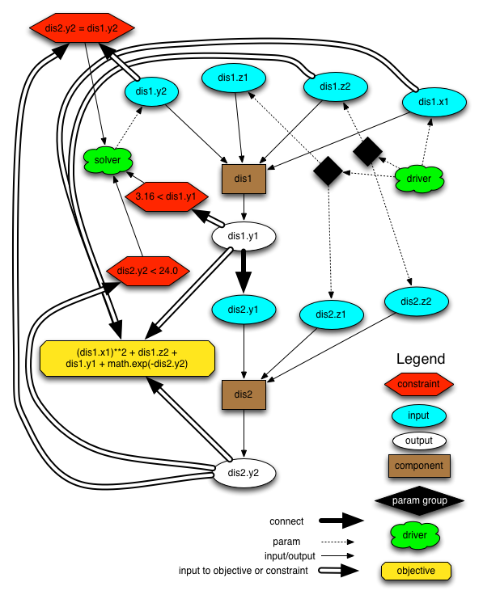

.. _`Case-Recording-Structure`:

Case Recording Structure
-------------------------

Overall Concepts
++++++++++++++++

The case recording system in OpenMDAO is designed such that by default everything is recorded.  OpenMDAO records all inputs and outputs of the model at all levels of the iteration hierarchy.  In addition it also records the metadata about the model, constants, inputs, and outputs. Users can then use the query system to post process the data and get at the data they really need.

Case recorders are assigned to the top level Assembly only.

The primary file formats for case recording in OpenMDAO are `JSON <http://en.wikipedia.org/wiki/JSON/>`_ and and its binary version,`BSON <http://en.wikipedia.org/wiki/BSON/>`_. They were chosen because of the following benefits:

* interoperability
* openness
* simplicity
* maps directly onto the data structures used in modern programming languages
* JSON is easy to read
* JSON is easy to parse using JavaScript

If users need to have the case records in another format, OpenMDAO provides post processors that convert the JSON and BSON case record files to those formats. The formats currently supported are CSV, sqlite, and a simple text-based data dump format.

.. seealso:: :ref:`Case-Recording`

Case Recording and Querying Classes
+++++++++++++++++++++++++++++++++++

Recording Classes
=================

The case recording system's three key classes are:

``_BaseRecorder`` - Base class for JSONRecorder and BSONRecorder. The key methods for this class are:

* ``get_case_info`` - get data for a particular case
* ``get_driver_info`` - get information about a given driver
* ``get_simulation_info`` - get about the overall simulation or model
* ``register`` - register a recorder to be used for recording the case data. 

``JSONRecorder`` - Dumps a run in JSON format to any object that looks like a file

``BSONRecorder`` - Dumps a run in BSON format to any object that looks like a file

The key method in these classes is:

* ``record`` - Dump the given run data

Query Classes
=================

The OpenMDAO query system lets the user read in a case record file and filter the data down to information that the user wants. 

The case query system's two key classes are:

``CaseDataset`` - Reads case data from a file-like object. The user can access the data using the Query object via the ``data`` property

``Query`` - Retains query information for a class ``CaseDataset``. All methods other than ``fetch`` and ``write`` return ``self``, so operations are easily chained. If the same method is called more than once, only the last call has an effect.

This diagram shows the relationship of these two classes and their main methods. Methods are shown in ovals.

.. _`relationship of CaseDataset and Query Objects and Methods`:

.. figure:: CaseDatasetQuery.png
   :align: center
   :alt: Figure shows shows the relationship of the CaseDataset and Query classes, their main methods when used to post process case records

   Relationship of CaseDataset and Query Objects and Methods

Key Methods of OpenMDAO's Workflow and Assembly Classes Involved in Case Recording
++++++++++++++++++++++++++++++++++++++++++++++++++++++++++++++++++++++++++++++++++

``Workflow.configure_recording``
        Called by Assembly.configure_recording at start of top-level run to configure case recording.

        If recording required, register input and output variables names in recorders.

``Workflow._record_case``
        Collect values for all the inputs and outputs for this case.

        Inputs are parameters while outputs are objectives, responses, constraints, other outputs.

        Tell all the registered recorders to record this case by calling their ``record`` method.

``Assembly.configure_recording``
        Called at start of top-level run to configure case recording

        Starts up the recorders, if they need any initialization

        Loop through all of the Containers in this Assembly that are either Assemblies or Drivers

        For drivers, just call configure_recording on the workflow. This returns inputs and outputs to record

        For assemblies, recursively call Assembly.configure_recording. So this just goes down the iteration hierarching and set what gets recorded and return inputs and constants

``Assembly.restore``
        Restore a given case into a Assembly. Used, for example to restart a simulation

How and Where Recording takes Place
+++++++++++++++++++++++++++++++++++

This section discusses the key methods involved in recording and when they take place in the flow of running a model.

Configuring recording is done once:

::

  * Component.run
    * Assembly._pre_execute
      * Assembly.configure_recording
        * Driver.configure_recording
          * Workflow.configure_recording

The call tree for the recording of the cases varies depending on the model and how nested it is but for a simple model here is where the cases are recorded:

::

  * Component.run
    * Assembly.execute
      * SimpleSystem.run
        * Driver.run
          * Component.run
            * SensitivityDriver.execute
              * Driver.run_iteration
                * Workflow.run
                  * Workflow._record_case

What Gets Recorded
++++++++++++++++++

The values that can be recorded are:

* Inputs

  * Parameters

* Outputs

  * Objectives
  * Responses
  * Constraints - both eq and ineq
  * Add the successors of the collapsed graph for all the Components in the driver's workflow
  * Any outputs of comps that are not connected vars and therefore not in the graph. This is done by getting the collapsed graph outputs of all the Components in the workflow
  * Workflow iteration name

Collapsed depgraph. What is that? Successors to components in the workflow. Include examples

Example Showing What Gets Recorded
++++++++++++++++++++++++++++++++++

To make this more concrete, we will use the example of the Sellar MDF problem :ref:`Sellar-MDF`.

.. _`Diagram of the Sellar MDF Model`:

   Diagram of the Sellar MDF Model

This table shows what gets recorded for each of the drivers, ``driver`` and ``solver`` and why they are being recorded in that case.

=============================  ===================   ===============================================
Variable                       driver                solver
=============================  ===================   ===============================================
dis1.x1                        parameter             NO
dis1.y1                        NO                    successor to dis1
dis1.y2                        NO                    parameter
dis1.z1                        parameter             NO
dis1.z2                        parameter             NO
dis2.y1                        NO                    NO
dis2.y2                        NO                    successor to dis2
dis2.z1                        parameter             NO
dis2.z2                        parameter             NO
p0 ( dis2.y2 = dis1.y2 )       NO                    constraint
p1 ( objective )               objective             NO
p2 ( constraint on dis1.y1 )   constraint            NO
p3 ( constraint on dis2.y2 )   constraint            NO
=============================  ===================   ===============================================

Recording options
+++++++++++++++++

By default OpenMDAO will record all variables in the model.  This can get to be a lot
of data and the associated file can be quite large.  You can change the default behavior
by modifying the ``recording_options`` variable tree in the top level assembly.  There
are three options:

============================  =======   ===============================================
Option                        Default   Description
============================  =======   ===============================================
``save_problem_formulation``  True      Save parameters, objectives, constraints, etc.
``includes``                  ['*']     Variables to include
``excludes``                  [ ]       Variables to exclude (processed after includes)
============================  =======   ===============================================

Structure of JSON files
++++++++++++++++++++++++

The JSON/BSON case recording files have three sections: metadata, driver information and cases.

The file maintains links between drivers and cases using unique ID numbers. It also assigns UUIDs (using Python's uuid module ) to cases and uses them to maintain a hierarchical link between cases and their parent cases. 

To save space, float arrays are represented using a binary encoding rather than text. Because of this, the difference
in size between the BSON and JSON versions of a case recording file is that that much.

Pro Tip: What’s a good way to view a JSON file? Use Google Chrome if it isn’t too big. Chrome lets you can expand/collapse the hierarchy of the JSON elements.

Metadata/Simulation Information
===============================

The metadata in the JSON/BSON file contains two graphs, both given in the form of JSON.

Collapsed dependency graph
    A data flow graph where each variable connection is collapsed into a single node
Component graph
    A graph showing the Components in the model and the connections between them

Other elements of the metadata are:

OpenMDAO version
    The version of OpenMDAO used to generate this case recording file
Constants
    The constants of the model including values. This includes many of the framework variables such as options for drivers
Expressions
    Mathematical expressions used to define objectives and constraints
Variable Metadata
    The variables in the model are defined in terms of whether are they inputs or outputs, type ( e.g. Float ), default value, allowed values, copying options, and more
Driver info
    Drivers are defined by their name in the model, parameters, equality and inequality constraints, objectives, and what variables are being recorded for that driver in its cases.

Driver Info
===========
The driver section has an element for each driver in the model. Each driver is described by:

* constraints, both equality and inequality
* name of the driver
* objectives
* parameters
* a list of what variables to record

Cases
=====
In addition to some internal bookkeeping data, the cases section is a list of all the cases as they are recorded in chronological order.

Each case is associated with a single driver.

In addition to containing the values recorded for this run of the driver, the case items include a possible error message from the run, error status and a timestamp for the run. The timestamp is the time the case is written.

TODO
====
What constitutes a case? What about cases from derivative calculation?

